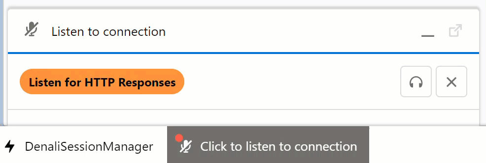

# SF_EmpAPIUtility
A Utility Bar Tool for EMP API Connections on Salesforce.

## U_EmpAPI
This is a Utility EMP API Component with globally accessible Aura methods for subscribing to and canceling a subscription to a platform event or push topic channel.

## DenaliListener
Sample Utility Bar Component for listening to custom HTTPResponse__e platform event.  Displays success/fail toast messages to end user after callouts are initiated.
